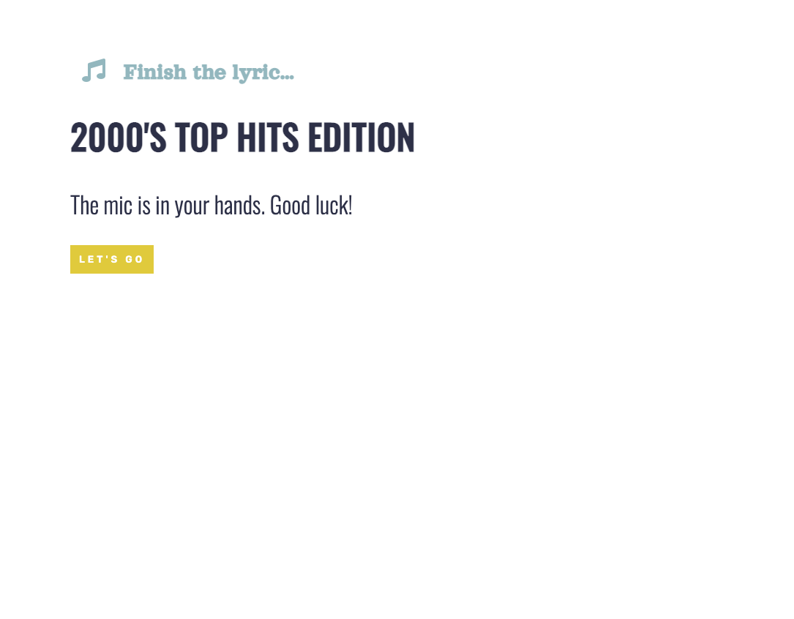
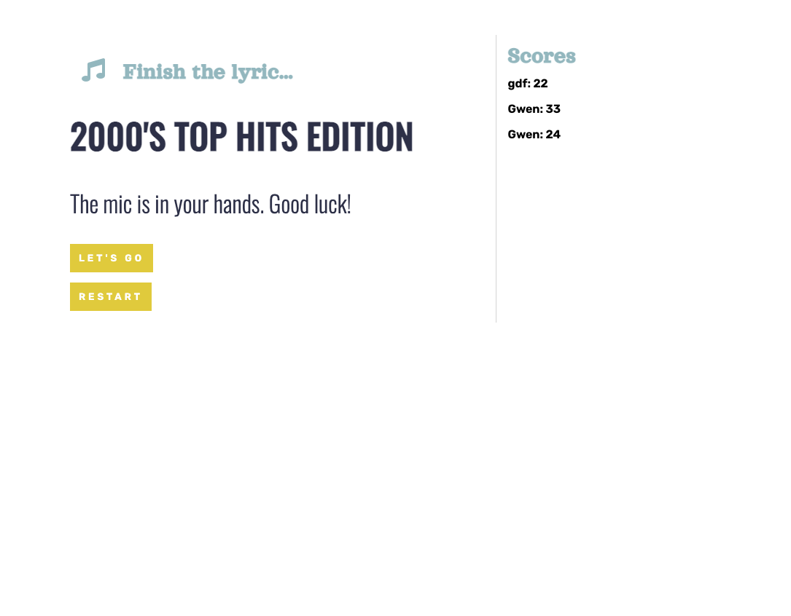

# 04 Web APIs: Code Quiz

## Description

I created a 6 quesiton quiz game. When the user clicks on the "Let's Go" button, it starts the timer - which also starts the game. The user must choose the correct answer to the question before going on to the next question.

When a question is answered correctly, an alert pops up telling them they got it right. When a question is answered incirrectly, they recieve an alert telling them they got it wrong and to try again, they also get 5 seconds deducted from the timer for every question answered incorrectly.

Once the user has answered all questions correctly, they are given thier score, and are prompted to type thier name to record thier name and score on the scoreboard.

A "Restart" button then appears, prompting the user to try again. If clicked, the game is reloaded and the timer starts over.

## Screenshots

## Links to Application

- Here is the repo: [gwenewasko/repo](https://github.com/gwenewasko/hw4)
- Here is the page: [gwenewasko/pages](https://gwenewasko.github.io/hw4/)
